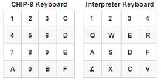

# References
https://ru.wikipedia.org/wiki/CHIP-8 - описание CHIP-8 
https://nachtimwald.com/2024/03/12/chip8-dev-challenge-sound/ - описание работы звукового таймера
http://devernay.free.fr/hacks/chip8/C8TECH10.HTM - описание инструкций

# CHIP-8 — виртуальная машина, созданная для обучения и простых игр. Его характеристики:
    Память: 4 КБ, из которых первые 512 байт зарезервированы для интерпретатора.
    Регистр: 16 регистров по 8 бит (V0-VF).
    Счетчик команд (PC): Указывает на текущую инструкцию (начинается с адреса 0x200).
    Стек: Для хранения адресов возврата (глубина до 16 уровней).
    Таймеры: Два таймера (таймер задержки и звуковой таймер).
    Графика: Разрешение 64x32 пикселя (черно-белое).
    Клавиатура: 16 клавиш (0-F).

# как организована память в CHIP8:

    0x000–0x1FF — Зарезервировано для интерпретатора.
    Это используется для встроенного кода интерпретатора, который в эмуляторе обычно отсутствует.
    0x050–0x09F — Стандартные шрифты CHIP-8.
    0x100–0x1FF — Расширенные шрифты Super-CHIP.
    Эти шрифты содержат спрайты высотой 10 байт (для цифр 0–F).
    0x200–0xFFF — Программа пользователя и динамические данные.
    Это пространство используется для загрузки игр.

# Формат опкодов
    Опкод — это 16-битное значение, разбитое на следующие части:
    
    0xNNNN: Константа, представляющая адрес или значение.
    0xXNNN: X — номер регистра.
    0xXYNN: X и Y — номера регистров.
    0xNN: Константа (обычно байт).
    
    30 стандартных опкодов CHIP-8
    CHIP-8 включает именно 30 опкодов. Вот их категории:
    
    Системные команды: 00E0, 00EE.
    Переходы и вызовы: 1NNN, 2NNN, 3XNN, 4XNN, 5XY0.
    Арифметические операции: 6XNN, 7XNN, 8XY0, 8XY1, 8XY2, 8XY3, 8XY4, 8XY5, 8XY6, 8XY7, 8XYE.
    Работа с памятью и таймерами: ANNN, BNNN, CXNN, FX07, FX0A, FX15, FX18, FX1E, FX29, FX33.
    Графика и клавиатура: DXYN, EX9E, EXA1.
    
    Дополнительные опкоды в Super-CHIP (SCHIP)
    Super-CHIP — расширение CHIP-8, добавляющее новые возможности, включая:
    
    Увеличенное разрешение (128x64).
    Дополнительные команды для управления графикой и памятью.
    Примеры дополнительных опкодов:
    
    00CN — Прокрутка экрана вниз на N линий.
    00FB — Прокрутка экрана вправо на 4 пикселя.
    00FC — Прокрутка экрана влево на 4 пикселя.
    00FD — Завершение программы (эмуляция).
    00FE — Переключение в режим стандартного CHIP-8.
    00FF — Переключение в режим Super-CHIP.

# KEY logics:

# System Instructions (0x00E0 and 0x00EE):  
    0x00E0: Clear the display.
    0x00EE: Return from a subroutine.
# Jump and Call Instructions (0x1NNN, 0x2NNN, 0xBNNN):  
    0x1NNN: Jump to address NNN.
    0x2NNN: Call subroutine at NNN.
    0xBNNN: Jump to address NNN + V0.
# Conditional Instructions (0x3XNN, 0x4XNN, 0x5XY0, 0x9XY0):  
    0x3XNN: Skip next instruction if VX == NN.
    0x4XNN: Skip next instruction if VX != NN.
    0x5XY0: Skip next instruction if VX == VY.
    0x9XY0: Skip next instruction if VX != VY.
# Arithmetic Instructions (0x8XY0 - 0x8XYE):  
    0x8XY0: Set VX = VY.
    0x8XY1: Set VX = VX | VY.
    0x8XY2: Set VX = VX & VY.
    0x8XY3: Set VX = VX ^ VY.
    0x8XY4: Set VX = VX + VY, set VF = carry.
    0x8XY5: Set VX = VX - VY, set VF = NOT borrow.
    0x8XY6: Set VX = VX >> 1, set VF = least significant bit of VX.
    0x8XY7: Set VX = VY - VX, set VF = NOT borrow.
    0x8XYE: Set VX = VX << 1, set VF = most significant bit of VX.
# Memory Instructions (0x6XNN, 0x7XNN, 0xANNN, 0xFX1E, 0xFX29, 0xFX33, 0xFX55, 0xFX65):  
    0x6XNN: Set VX = NN.
    0x7XNN: Set VX = VX + NN.
    0xANNN: Set I = NNN.
    0xFX1E: Set I = I + VX.
    0xFX29: Set I = location of sprite for digit VX.
    0xFX33: Store BCD representation of VX in memory locations I, I+1, and I+2.
    0xFX55: Store registers V0 through VX in memory starting at location I.
    0xFX65: Read registers V0 through VX from memory starting at location I.
# Random Number and Display Instructions (0xCXNN, 0xDXYN):  
    0xCXNN: Set VX = random byte AND NN.
    0xDXYN: Display N-byte sprite starting at memory location I at (VX, VY), set VF = collision.
# Keyboard Instructions (0xEX9E, 0xEXA1, 0xFX07, 0xFX0A, 0xFX15, 0xFX18):  
    0xEX9E: Skip next instruction if key with the value of VX is pressed.
    0xEXA1: Skip next instruction if key with the value of VX is not pressed.
    0xFX07: Set VX = delay timer value.
    0xFX0A: Wait for a key press, store the value of the key in VX.
    0xFX15: Set delay timer = VX.
    0xFX18: Set sound timer = VX.