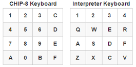

# CHIP-8 Emulator
**CREATED BY KOVALENKO PAVEL NSU 2025**

## 1. Введение
- В данном проекте реализована эмуляция CHIP-8, ее модернизированная версия SUPER CHIP находится в стадии разработки.
- На данный момент реализована логика выполнения команд, отрисовка, управление с клавиатуры и вывод звука (с моим авторским звуковым эффектом), а также интерфейс для удобного выбора игры.

## 2. Использование
- Используйте клавиши `PgUp` и `PgDn` для выбора нужной игры и нажмите `Enter`.
- Чтобы вернуться в меню, нажмите `Escape`.

Многие игры просто отображают статические или динамические изображения. Некоторые игры могут не работать из-за их некорректности, но следующие игры точно работают:
- `Breakout (Brix hack) (by David Winter)(1997).ch8`
- `Br8kout (by SharpenedSpoon)(2014).ch8`
- `Astro Dodge (fix)[Revival Studios, 2008].ch8`
Попробуйте разные игры, чтобы увидеть, какие из них работают.

### Управление
    I/O : Q  < --- >  E
    I/O : A  < --- >  D
                2
    I/O : Q  < --- >  E 
                S   
в остальных играх управление неизвестно, методом тыка можно попробовать найти нужные клавиши.

## Логика клавиш
